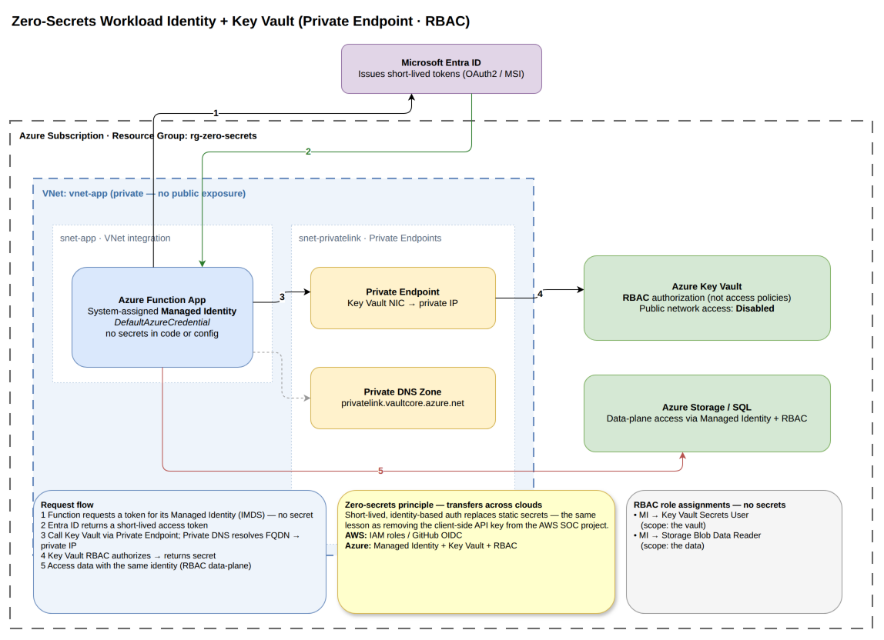

# Zero-Secrets Workload Identity + Key Vault (Azure)

A small, deliberately-minimal Azure project that demonstrates one principle:

> **No secrets in code or config. Ever.**
>
> An app authenticates to Azure resources using a **managed identity** (a
> credential Azure manages and rotates for you — you never see it), and pulls the
> secrets it *does* need from **Azure Key Vault**, authorized by **RBAC** (not
> access policies) and reachable over a **private network path**.

It is the Azure companion to the AWS "AI SOC Chatbot" project. Same lesson —
**short-lived, identity-based auth beats static secrets** — expressed in a second
cloud. See [Why this pairs with the AWS project](#why-this-pairs-with-the-aws-project).

---

## Table of contents

1. [The problem this solves](#the-problem-this-solves)
2. [The idea in one picture](#the-idea-in-one-picture)
3. [How "zero secrets" is actually enforced](#how-zero-secrets-is-actually-enforced)
4. [Architecture, component by component](#architecture-component-by-component)
5. [Key design decisions (and why)](#key-design-decisions-and-why)
6. [Cost model — how it stays free](#cost-model--how-it-stays-free)
7. [Configuration & toggles](#configuration--toggles)
8. [Deploy it](#deploy-it)
9. [Prove it (verify zero secrets)](#prove-it-verify-zero-secrets)
10. [Tear it down](#tear-it-down)
11. [Known apply-time caveats](#known-apply-time-caveats)
12. [Why this pairs with the AWS project](#why-this-pairs-with-the-aws-project)
13. [File layout](#file-layout)
14. [Status & roadmap](#status--roadmap)

---

## The problem this solves

The classic way apps get access to a database, an API, or a secret store is a
**stored credential**: a connection string in `appsettings.json`, an API key in
an environment variable, an account key in a pipeline. Every one of those is a
long-lived secret that can be committed to git, copied to a laptop, screenshotted,
or leaked — and then it works forever until someone notices and rotates it.

This project removes stored credentials entirely by using two Azure building
blocks together:

- **Managed identity** — Azure gives the app an identity in Entra ID. When the app
  needs to call a resource, the platform hands it a **short-lived token** (minutes,
  not months). There is no password, key, or certificate for you to store or leak.
- **Key Vault + RBAC** — the one secret the app genuinely needs (a downstream API
  key, say) lives in Key Vault. The app retrieves it **using its managed
  identity**, and Key Vault decides yes/no purely on **Azure RBAC role
  assignments**. Nothing is granted by a secret; everything is granted to an
  *identity*.

Net result: the only thing that grants access anywhere in this system is *who you
are* (an identity), never *what you know* (a secret).

---

## The idea in one picture



**Request flow:**

1. The app asks Azure for a token for its **managed identity** (via the instance
   metadata endpoint). No secret is involved.
2. **Entra ID** returns a **short-lived access token**.
3. The app calls **Key Vault**. In the private-endpoint posture, the vault's
   hostname resolves (via a **Private DNS zone**) to a **private IP** and traffic
   crosses a **Private Endpoint** — never the public internet. In the free
   posture, it goes over a **service endpoint** (still off the public internet,
   still RBAC-gated).
4. Key Vault checks **RBAC** (the identity holds *Key Vault Secrets User*) and
   returns the secret.
5. The app reaches a **second resource** (Storage) with the *same* identity and a
   data-plane RBAC role — again, no keys.

---

## How "zero secrets" is actually enforced

This isn't just a naming convention — each claim is backed by a concrete setting:

| Claim | Enforced by | Where |
|-------|-------------|-------|
| App has no credential | System gives it a **user-assigned managed identity**; no password/cert exists | `identity.tf` |
| Key Vault grants access by identity, not secret | `rbac_authorization_enabled = true` → **RBAC only, access policies disabled** | `keyvault.tf` |
| The app's secret never appears in config | Container App references the secret by **Key Vault URI + identity**, not value | `containerapp.tf` (`secret { identity = …, key_vault_secret_id = … }`) |
| Storage has no leakable key | `shared_access_key_enabled = false` → account keys turned off; Entra-only | `storage.tf` |
| Traffic avoids the public internet | Service endpoint (free) or Private Endpoint + Private DNS (toggle) | `network.tf`, `private_endpoint.tf` |
| Nothing sensitive in the repo | `terraform.tfvars`, `*.tfstate`, `.env` gitignored | `.gitignore` |

If you grep this entire repo for a secret value, you won't find one — the demo
secret's *value* is a throwaway string created at apply time, and the app only
ever holds a **reference** to it.

---

## Architecture, component by component

Everything lives in one resource group, **`rg-zero-secrets`** (region `eastus`).

### Networking (`network.tf`)
- **`vnet-app`** (`10.20.0.0/16`) — the private network; nothing is publicly exposed.
- **`snet-app`** (`10.20.0.0/23`) — the Container Apps environment is injected here.
  It is *delegated* to `Microsoft.App/environments` and carries **service
  endpoints** for Key Vault and Storage (the free way to keep traffic on Azure's
  backbone).
- **`snet-privatelink`** (`10.20.2.0/24`) — holds the Private Endpoint, only when
  that toggle is on.

### Identity (`identity.tf`)
- **`id-app`** — a **user-assigned managed identity**. This is the app's entire
  "credential." It holds three role assignments:
  - **Key Vault Secrets User** on the vault (read secrets),
  - **Storage Blob Data Reader** on the storage account (read blobs),
  - and your deployer identity gets **Key Vault Secrets Officer** so Terraform can
    *write* the demo secret (an RBAC vault has no access policies to fall back on),
  - plus **Storage Blob Data Owner** (scoped to the resource group) for the
    deployer, so Terraform can reach the storage *data plane* over Entra auth —
    the account has no keys, and control-plane Owner does **not** grant data
    access. RG scope (not account scope) avoids a create-time dependency cycle.
- A **45-second `time_sleep`** absorbs RBAC's eventual-consistency lag so the
  secret write / read doesn't race the role assignments.

### Key Vault (`keyvault.tf`)
- RBAC-authorized (**no access policies**), soft-delete on, **purge protection off**
  (so teardown is free and complete).
- Public access is **off** when a private endpoint is used; otherwise it stays
  reachable but **RBAC-gated**, and network-gated when `restrict_network = true`.
- Contains one demo secret, `demo-downstream-api-key`, standing in for "the one
  real secret the app needs."

### Storage (`storage.tf`)
- The **second resource** the app talks to, proving identity-based access isn't
  Key-Vault-specific.
- **`shared_access_key_enabled = false`** — there is literally no account key to
  steal; callers must present an Entra token.

### Compute (`containerapp.tf`)
- **Log Analytics** workspace + **Container Apps environment**, VNet-injected and
  **internal only** (no public ingress).
- **`ca-zero-secrets`** — the app. It runs a stock hello-world image, uses the
  user-assigned identity, and declares a **secret sourced from Key Vault by
  reference**, surfaced to the container as the `DOWNSTREAM_API_KEY` env var. It
  also gets `AZURE_CLIENT_ID` (so real code using `DefaultAzureCredential` knows
  which identity to use) and the storage account name. Scales to zero.

### Private endpoint (`private_endpoint.tf`)
- Behind `enable_private_endpoint`. Adds the **Private DNS zone**
  (`privatelink.vaultcore.azure.net`), a VNet link, and the **Private Endpoint**
  itself. This is the only paid piece — see [Cost model](#cost-model--how-it-stays-free).

---

## Key design decisions (and why)

**User-assigned managed identity (not system-assigned).**
The diagram shows "managed identity" generically, but the code uses a *user-assigned*
one. Reason: the Container App reads the Key Vault secret **at creation time**, which
means the identity must *already* hold the *Key Vault Secrets User* role before the
app exists. A system-assigned identity doesn't exist until its host is created — a
chicken-and-egg loop. A user-assigned identity is created first, granted the role,
*then* attached to the app. (It's also reusable across multiple resources.)

**RBAC authorization, not access policies.**
Key Vault supports two permission models. Access policies are vault-local and
easy to sprawl; **RBAC** uses the same Azure role system as everything else, is
auditable centrally, and supports least-privilege data-plane roles like *Key Vault
Secrets User*. Using RBAC is a core requirement of the premise.

**Service endpoint by default, private endpoint by toggle.**
A private endpoint is the "textbook" private path — but it costs ~$7/month. A
**service endpoint** keeps traffic on Azure's backbone and RBAC-gates the vault for
**free**. So the default posture is free-but-legit, and the private endpoint is one
flag away for when you want the real thing for a portfolio screenshot.

**Storage account keys disabled.**
Turning off `shared_access_key_enabled` is what makes the "no keys" claim true
rather than aspirational — it removes the fallback that most storage code silently
relies on.

---

## Cost model — how it stays free

| Component | Cost |
|-----------|------|
| Container Apps (Consumption, scale-to-zero) | **~$0** — covered by the monthly free grant |
| Key Vault | **~$0** — billed per operation (pennies per 10k) |
| VNet, subnets, service endpoints, managed identity, RBAC | **Free** |
| Storage account | **Pennies** at rest for a demo |
| Log Analytics | Small ingestion cost; trivial for a demo |
| **Private endpoint** (only if `enable_private_endpoint = true`) | **~$7/month** while it exists (billed hourly → pennies if you build, demo, destroy) |

**Bottom line:** left in its default configuration, this project is effectively
free. The single paid component is opt-in and easy to tear down.

---

## Configuration & toggles

All in `variables.tf`; copy `terraform.tfvars.example` to `terraform.tfvars` to override.

| Variable | Default | Purpose |
|----------|---------|---------|
| `subscription_id` | <org> sub | Where to deploy |
| `location` | `eastus` | Region |
| `deployer_object_id` | James | Gets *Key Vault Secrets Officer* to seed the secret |
| `enable_private_endpoint` | `false` | `true` = add PE + private DNS, disable public access (~$7/mo) |
| `restrict_network` | `false` | `true` = lock KV/Storage public endpoints to the app subnet + your IP |
| `deployer_ip` | `""` | Your public IP to allow when `restrict_network = true` |

**Recommended rollout:** first apply with both toggles `false` (so the secret
seeds cleanly), confirm it works, then set `restrict_network = true` (and your
`deployer_ip`) to lock down, and/or `enable_private_endpoint = true` for the
private-endpoint demo.

---

## Deploy it

Authentication is your own `az login` (Owner) identity — no service principal needed.

```bash
az login                     # if not already signed in
az account show              # confirm the right subscription

# One-time: register the Container Apps resource provider on the subscription.
# Skip and the first apply fails with MissingSubscriptionRegistration (Microsoft.App).
az provider register --namespace Microsoft.App --wait

terraform init
terraform plan               # read-only, no charges — review the resource list
terraform apply              # creates resources (free in the default posture)
```

Because the storage account has shared-key auth disabled, the provider is
configured with `storage_use_azuread = true` (in `main.tf`) so it talks to the
storage data plane using your Entra identity rather than an account key.

Real application code would authenticate like this (no secret anywhere):

```python
from azure.identity import DefaultAzureCredential
from azure.keyvault.secrets import SecretClient

cred = DefaultAzureCredential()   # uses the managed identity at runtime
client = SecretClient(vault_url=KEY_VAULT_URI, credential=cred)
api_key = client.get_secret("demo-downstream-api-key").value
```

---

## Prove it (verify zero secrets)

After `apply`:

- **No access policies on the vault:**
  `az keyvault show -n <kv-name> --query properties.enableRbacAuthorization` → `true`
- **No storage keys usable:**
  `az storage account show -n <name> --query allowSharedKeyAccess` → `false`
- **The app carries only a reference, not a value:**
  inspect the Container App's `secret` block — it stores a Key Vault URI + an
  identity, never the secret text.
- **Grep the repo:** no secret value is present in code, config, or state
  (state is gitignored anyway).

---

## Tear it down

```bash
terraform destroy
```

Purge protection is off and secrets purge on destroy, so the resource group goes
away cleanly with no lingering (billable) private endpoint and no soft-deleted
vault blocking a future redeploy of the same name.

---

## Known apply-time caveats

These were the runtime risks on the first real `apply`. All are resolved in the
current code; kept here as a record of what to watch:

1. **`Microsoft.App` not registered** — a fresh subscription that has never used
   Container Apps returns `MissingSubscriptionRegistration`. Fixed by the one-time
   `az provider register --namespace Microsoft.App` step above.
2. **Keyless storage + data-plane auth** — with `shared_access_key_enabled = false`,
   the provider's default key-based data-plane calls (blob-service polling, container
   creation) fail with `403 Key based authentication is not permitted`. Fixed by
   `storage_use_azuread = true` plus a **Storage Blob Data Owner** role for the
   deployer, scoped at the resource group to avoid a create-time dependency cycle.
3. **Subnet delegation + service endpoints** — `snet-app` is both delegated to
   Container Apps *and* carries Key Vault/Storage service endpoints. That combo can
   occasionally conflict; if apply complains, the fix is to move the service
   endpoints or rely on the private-endpoint path instead.
4. **RBAC propagation** — even with the 45s wait, role assignments are eventually
   consistent; a first apply can fail on the secret write/read and succeed on
   re-apply.
5. **Container App secret resolution** — the app resolves the Key Vault secret at
   create time, so it depends on the identity's role already being live.

---

## Why this pairs with the AWS project

The AWS "AI SOC Chatbot" project reached the same conclusion from the other side:
its early design shipped a **client-side API key**, which we removed in favor of
identity-based auth (Cognito-issued JWTs to the API, IAM roles for services, and a
GitHub **OIDC** deploy role instead of stored cloud keys). The lesson there and
here is identical:

| | AWS SOC project | This Azure project |
|--|-----------------|--------------------|
| App-to-service auth | IAM roles (STS short-lived creds) | Managed identity (short-lived tokens) |
| Human/CI to cloud | GitHub **OIDC** federated role (no stored keys) | `az login` now; OIDC federation is the roadmap |
| Secret handling | Removed the client-side API key | Secrets in Key Vault, fetched by identity |
| Authorization | Least-privilege IAM policies | Least-privilege **RBAC** roles |
| Principle | **Identity over static secrets** | **Identity over static secrets** |

Demonstrating the same principle in **two different clouds** is the point: it shows
the idea is architectural, not vendor-specific — which is what "cloud security
engineer" actually means.

---

## File layout

```
main.tf                 provider, versions, resource group, naming
variables.tf            inputs + the free/lockdown/private-endpoint toggles
network.tf              VNet + app subnet (delegated) + private-link subnet
identity.tf             user-assigned MI + RBAC role assignments + propagation wait
keyvault.tf             RBAC Key Vault (no access policies) + demo secret
storage.tf              keyless storage (second resource) + container
containerapp.tf         Log Analytics, Container Apps env, the app itself
private_endpoint.tf     PE + private DNS zone (toggle)
outputs.tf              vault URI, identity client ID, names, etc.
terraform.tfvars.example  copy to terraform.tfvars (gitignored) to override
zero-secrets-architecture.drawio(.png)  the diagram above
```

---

## Status & roadmap

- [x] Architecture diagram
- [x] Terraform scaffolded — `init` + `validate` clean
- [x] `terraform apply` (default free posture) — **deployed and verified**
- [ ] Optional: real app code using `DefaultAzureCredential`
- [ ] Optional: remote Terraform backend (shared Azure Storage), like the CA/PIM project
- [ ] Optional: GitHub OIDC deploy federation (retire even the `az login` step)

> **Status: applied to Azure.** The default free posture is deployed in resource
> group `rg-zero-secrets` (Key Vault `kv-zsec-2imzc`, storage `stzsec2imzc`,
> Container App `ca-zero-secrets`). Tear down with `terraform destroy` when done.
